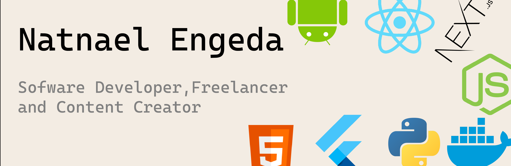

<h1 >Natnael Engeda ⚡</h1>

I'm a software engineer who is passionate about making contributing to open-source more approachable, creating technology to elevate people, and building community.Some technologies I enjoy working with include ReactJS, Nextjs, Nodejs/Express and Flutter. 

You can find all my projects here
- 👨‍💻 &nbsp;Read more about my projects at [natnaelengeda.tech](https://www.natnaelengeda.tech/)
---

🔗 &nbsp;**Connect with me**

---
<h2>Github Stats</h2>

 

---
<h2>Most Used Languages</h1>

---
<h2>Contributions</h2>

 
---
###
 
